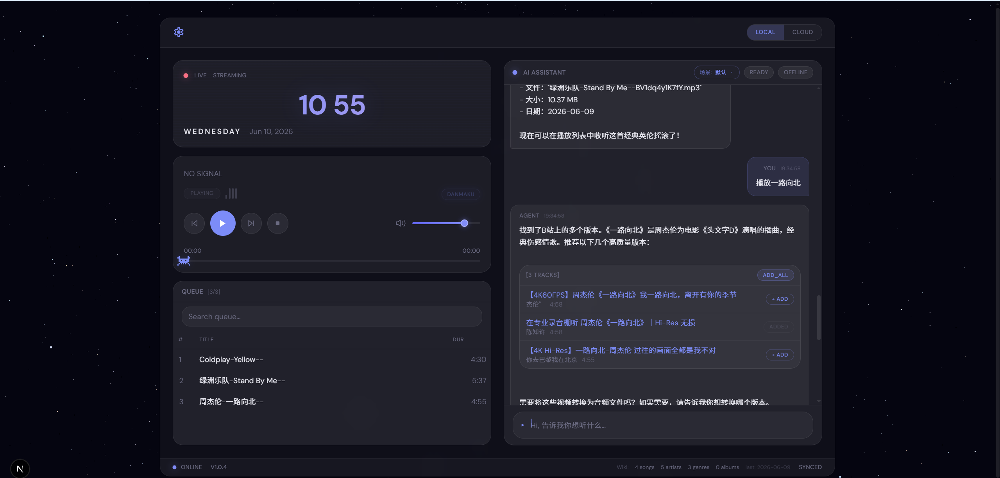
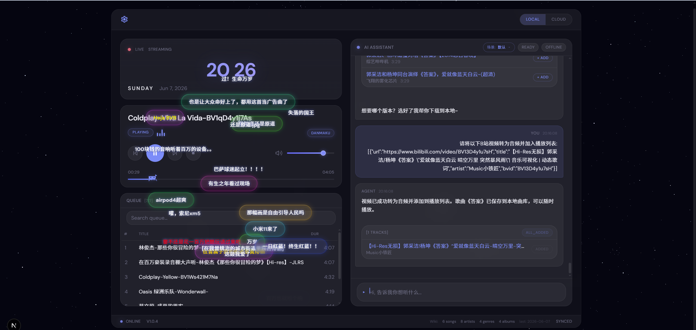
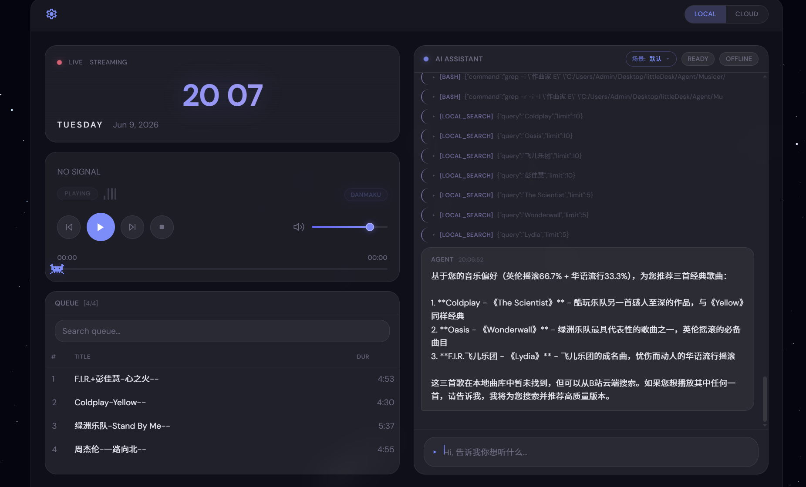
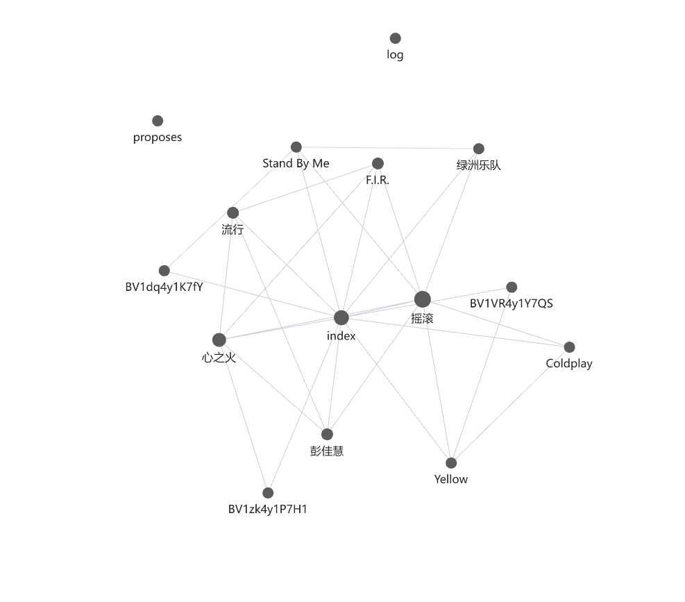

[](LICENSE)
[](https://nodejs.org/)
[](https://python.org/)

# Musicer

AI Agent 驱动的 B站音频播放器。随时随地，想听就听，不止于音乐。







## Features

- **LangGraph ReAct Agent** — LLM 自主决策工具调用，多轮迭代推理，SSE 流式输出
- **前端 LLM 配置** — 齿轮按钮打开设置弹窗，随时切换 API Key / Base URL / Model，无需重启
- **双模式切换** — 本地曲库搜索 / B站云端搜索
- **云端本地优先** — 云端 ADD 自动检测本地已有文件，避免重复转换
- **B站全链路** — 视频搜索（WBI 签名）→ 转 MP3 下载 → 弹幕叠加播放 → 自动入库知识库
- **弹幕播放** — 播放 B站歌曲时实时叠加弹幕，同步播放进度
- **分层记忆系统** — 短期（对话）/ 中期（JSONL 历史）/ 长期（用户画像），Dream 引擎自动沉淀
- **LLM-Wiki 知识库** — 基于 Karpathy llm-wiki 方法论，自动消化入库歌曲为结构化知识库，并构建一个知识图谱

  
- **场景感知推荐** — 自定义场景（编程/跑步/睡觉等），每个场景独立维护偏好
- **知识库检索子 Agent** — 独立 LangGraph 子图，用户画像上下文感知进行个性化推荐
- **画像增强搜索** — 推荐类查询自动注入用户画像中的流派/歌手到搜索关键词
- **斜杠命令** — 聊天中输入 `/reset-wiki`、`/reset-memory`、`/clear` 等管理命令

## Tech Stack

| 层       | 技术                                              |
| -------- | ------------------------------------------------- |
| 前端     | Next.js 16 (App Router) / React 19 / TypeScript 5 |
| 样式     | Tailwind CSS 4 + CSS Variables                    |
| 3D       | Three.js（MusicVisualizer / ParticleBackground）  |
| 后端     | Python FastAPI + LangGraph                        |
| AI       | LangGraph React Agent（OpenAI 兼容 API）          |
| 记忆     | JSONL 历史 + Markdown 用户画像 + Dream 引擎       |
| 知识库   | LLM-Wiki（本地 Markdown wiki + grep 检索）        |
| 数据库   | SQLite（播放列表持久化）                          |
| 外部工具 | bv2mp3 + ffmpeg（视频转音频）                     |

## Architecture

```
┌──────────────────────────────────────────────────────────────────────────────────┐
│                            Next.js 前端 (localhost:3002)                          │
│  ┌──────────┐  ┌──────────┐  ┌──────────┐  ┌──────────┐  ┌──────────────────┐  │
│  │AgentChat │  │ Player   │  │Playlist  │  │Settings  │  │CommandInput      │  │
│  │(SSE 流式)│  │(音频播放) │  │(播放队列) │  │Modal     │  │(/斜杠命令)        │  │
│  └────┬─────┘  └────┬─────┘  └──────────┘  └──────────┘  └──────────────────┘  │
│       │ SSE          │ Range                                              │      │
└───────┼──────────────┼──────────────────────────────────────────────────────────┘
        │              │
        ▼              ▼
┌──────────────────────────────────────────────────────────────────────────────────┐
│                         FastAPI 后端 (localhost:8000)                             │
│                                                                                  │
│  ┌────────────────────────────────────────────────────────────────────────────┐  │
│  │                           Main Agent (LangGraph)                          │  │
│  │                                                                            │  │
│  │  ┌─────────────┐    ┌─────────────┐    ┌─────────────────────────────┐    │  │
│  │  │  AgentNode  │───▶│  ToolNode   │───▶│  工具执行结果返回 AgentNode   │    │  │
│  │  │ (LLM 决策)  │◀───│ (工具路由)   │    │  直到 LLM 输出最终回答       │    │  │
│  │  └─────────────┘    └──────┬──────┘    └─────────────────────────────┘    │  │
│  │                            │                                              │  │
│  └────────────────────────────┼──────────────────────────────────────────────┘  │
│                               │                                                 │
│         ┌─────────────────────┼──────────────────────────────┐                  │
│         │                     │                              │                  │
│         ▼                     ▼                              ▼                  │
│  ┌─────────────┐    ┌──────────────┐              ┌──────────────────┐         │
│  │local_search │    │ bili_search  │              │   wiki_search    │         │
│  │本地曲库搜索  │    │ B站视频搜索   │              │   知识库检索      │         │
│  └─────────────┘    └──────┬───────┘              └────────┬─────────┘         │
│                            │                               │                    │
│                            ▼                               ▼                    │
│                     ┌──────────────┐            ┌──────────────────────┐        │
│                     │convert_video │            │   Wiki Sub-Agent     │        │
│                     │视频→MP3 转换  │            │   (LangGraph 子图)   │        │
│                     │  + 入库       │            │                      │        │
│                     └──────┬───────┘            │  ┌────────┐          │        │
│                            │                    │  │AgentNode│──┐      │        │
│                            ▼                    │  └────────┘  │      │        │
│                  ┌──────────────────┐           │       ▲      ▼      │        │
│                  │  wiki_ingest     │           │  ┌────────┐ ┌────┐  │        │
│                  │  LLM 分析 → 生成  │           │  │ToolNode│◀│bash│  │        │
│                  │  实体页 → 重命名   │           │  └────────┘ └────┘  │        │
│                  └──────────────────┘           └──────────────────────┘        │
│                                                                                  │
│  ┌────────────────────────────────────────────────────────────────────────────┐  │
│  │                          分层记忆系统                                       │  │
│  │                                                                            │  │
│  │  ┌──────────────┐  ┌──────────────────┐  ┌──────────────────────────┐    │  │
│  │  │  短期记忆     │  │  中期记忆         │  │  长期记忆                 │    │  │
│  │  │  对话上下文    │  │  history.jsonl   │  │  user_profile.md         │    │  │
│  │  │  (内存)       │  │  (JSONL 文件)     │  │  (Markdown，按场景分组)   │    │  │
│  │  └──────────────┘  └────────┬─────────┘  └────────────┬─────────────┘    │  │
│  │                             │                          │                  │  │
│  │                             └──────────┬───────────────┘                  │  │
│  │                                        ▼                                  │  │
│  │                          ┌──────────────────────────┐                     │  │
│  │                          │      Dream Engine        │                     │  │
│  │                          │  自动沉淀：对话 → 画像     │                     │  │
│  │                          │  每 5+ 条新记录自动触发    │                     │  │
│  │                          └──────────────────────────┘                     │  │
│  └────────────────────────────────────────────────────────────────────────────┘  │
│                                                                                  │
│  ┌────────────────────────────────────────────────────────────────────────────┐  │
│  │                          LLM-Wiki 知识库                                   │  │
│  │                                                                            │  │
│  │  index.md ─── 实体索引（歌曲/歌手/专辑/流派）                                │  │
│  │  alias-index.json ── 别名映射                                               │  │
│  │  wiki/entities/                                                             │  │
│  │    ├── artists/   (歌手页：Coldplay.md, Oasis.md...)                        │  │
│  │    ├── songs/     (歌曲页：Viva La Vida.md...)                              │  │
│  │    ├── albums/    (专辑页：范特西.md...)                                     │  │
│  │    └── genres/    (流派页：摇滚.md, 英伦摇滚.md...)                           │  │
│  └────────────────────────────────────────────────────────────────────────────┘  │
│                                                                                  │
└──────────────────────────────────────────────────────────────────────────────────┘
```

### Agent 调用流程

```
用户: "推荐三首歌给我"
  │
  ▼
Main Agent (LLM 决策)
  │
  ├─ 读取 system prompt（含用户画像）
  │
  ├─ 调用 wiki_search("推荐英伦摇滚 Coldplay Oasis...")
  │    │
  │    ├─ _extract_query_keywords → 提取实体关键词
  │    ├─ _extract_profile_entities → 注入画像中的流派/歌手
  │    └─ Wiki Sub-Agent (LangGraph)
  │         ├─ grep index.md → 匹配实体
  │         ├─ cat 实体文件 → 读取内容
  │         ├─ 遍历 [[wikilinks]] → 读取关联实体
  │         └─ 综合评分 → 返回结果
  │
  ├─ LLM 基于知识库结果 + 画像生成推荐
  │
  └─ 输出 tracks 代码块 → 前端渲染播放列表
```

## Getting Started

### 前置条件

- Node.js >= 20
- Python >= 3.12
- AI API Key
- ffmpeg（视频转音频依赖）
- bv2mp3：`npm install -g bv2mp3`

### 手动安装方式

#### 1. 克隆项目

```bash
git clone https://github.com/pstrm-dev/musicer.git
cd musicer
```

#### 2. 配置环境变量

前后端配置已分离，各自读取自己目录下的配置文件：

```env
# frontend/.env — 前端配置（Next.js 自动加载）
BACKEND_URL=http://localhost:8000
MUSIC_DIR=Documents/bili

# backend/.env — 后端配置（Python FastAPI）
OPENAI_BASE_URL=https://api.deepseek.com
MODEL_NAME=deepseek-chat
MUSIC_DIR=Documents/bili
BACKEND_PORT=8000

# backend/.env.local — 后端私密配置（git 自动忽略）
OPENAI_API_KEY=your-api-key-here
```

> 前后端的 `MUSIC_DIR` 需保持一致，指向同一个音乐目录。

也可以启动后通过前端齿轮按钮（⚙）在线配置 LLM 参数，配置会自动写入 `backend/.env.local`。

#### 3. 安装依赖

```bash
# 前端依赖
npm install

# 后端依赖（推荐使用 uv）
cd backend
uv venv .venv --python 3.12
uv pip install -r requirements.txt
cd ..
```

#### 4. 启动服务

需要同时运行前后端两个服务（开两个终端窗口）：

**终端 1 — 后端：**

```bash
cd backend
.\.venv\Scripts\python.exe -m uvicorn main:app --reload        # Windows PowerShell
.venv/Scripts/python.exe -m uvicorn main:app --reload           # Git Bash / macOS / Linux
```

**终端 2 — 前端：**

```bash
npm run dev
```

#### 5. 打开浏览器

访问 http://localhost:3002

首次使用点击左上角齿轮按钮 ⚙ 配置 LLM API Key。

### Claude/OpenClaw/Hermes自动安装

> 输入: 帮我安装并启动项目:https://github.com/QuanLong427/Musicer.git

## Port Configuration

| 服务 | 默认端口 | 配置位置                                             |
| ---- | -------- | ---------------------------------------------------- |
| 前端 | 3002     | `package.json` → `scripts.dev` 中的 `-p` 参数 |
| 后端 | 8000     | `backend/.env` → `BACKEND_PORT=8000`            |

修改前端端口：编辑 `package.json` 中 `dev` 脚本的 `-p` 参数。
修改后端端口：修改 `backend/.env` 中的 `BACKEND_PORT`，重启后端。

## Project Structure

```
Musicer/
├── frontend/                   # Next.js 前端
│   ├── app/
│   │   ├── page.tsx            # 主页面（单页应用）
│   │   ├── layout.tsx          # 根布局（字体、全局样式）
│   │   ├── api/                # API 路由代理（转发至后端）
│   │   │   ├── chat/           # SSE 流式聊天
│   │   │   ├── config/         # LLM 配置读写
│   │   │   ├── bili/           # B站搜索 + 弹幕
│   │   │   ├── tracks/         # 音频文件服务
│   │   │   ├── playlist/       # 播放列表
│   │   │   ├── scenarios/      # 场景管理
│   │   │   ├── history/        # 对话历史
│   │   │   └── wiki/           # 知识库操作
│   │   ├── components/         # UI 组件（Atomic Design）
│   │   │   ├── atoms/          # Logo, ModeSwitch, DanmakuOverlay...
│   │   │   ├── molecules/      # ChatMessage, ControlBar, SeekBar...
│   │   │   └── organisms/      # Player, AgentChat, SettingsModal...
│   │   ├── context/            # React Context 状态管理
│   │   │   ├── AgentContext     # AI 聊天状态
│   │   │   ├── PlayerContext    # 音频播放状态
│   │   │   ├── DanmakuContext   # 弹幕状态
│   │   │   └── ModeContext      # 本地/云端模式
│   │   ├── hooks/              # useAudioPlayer, useSSE, useClock
│   │   └── lib/                # API, Types, Bilibili WBI 签名
│   └── .env                    # 前端环境变量
│
├── backend/                    # Python 后端
│   ├── main.py                 # FastAPI 入口 + 生命周期管理
│   ├── config.py               # 配置管理（支持运行时更新）
│   ├── models.py               # Pydantic 数据模型
│   ├── routers/                # API 路由
│   │   ├── chat.py             # POST /api/chat（SSE 流式）
│   │   ├── config.py           # GET/PUT /api/config
│   │   ├── bili.py             # B站搜索 + 弹幕
│   │   ├── search.py           # 本地曲库搜索
│   │   ├── tracks.py           # 音频文件服务 + bvid 查询
│   │   ├── playlist.py         # 播放列表 CRUD
│   │   ├── scenario.py         # 场景管理
│   │   ├── dream.py            # Dream 引擎触发
│   │   ├── history.py          # 对话历史
│   │   └── wiki.py             # LLM-Wiki 操作
│   ├── services/               # 业务逻辑
│   │   ├── ai_agent.py         # LangGraph Agent（核心）
│   │   ├── bili_client.py      # B站 API（WBI 签名）
│   │   ├── music_manager.py    # 本地音乐扫描
│   │   ├── memory_manager.py   # 分层记忆
│   │   ├── dream_engine.py     # Dream 引擎
│   │   ├── wiki_ingest.py      # LLM-Wiki 入库
│   │   └── playlist_store.py   # SQLite 播放列表
│   ├── .env / .env.local       # 后端配置
│   └── requirements.txt
│
├── skills/                     # Agent 技能定义（SKILL.md）
│   ├── cloud-search/           # B站云端搜索
│   ├── convert/                # 视频转音频
│   ├── local-search/           # 本地曲库搜索
│   └── slash-commands/         # 斜杠命令
│
├── memory/                     # 记忆系统
│   ├── template/               # 模板文件
│   └── data/                   # 运行时数据（gitignore）
│
├── LLM-Wiki/                   # 知识库（运行时生成）
├── Documents/bili/             # 默认音乐存储目录
├── db/scenario.yml             # 场景配置
└── docker-compose.yml
```

## API Endpoints

| 方法            | 路径                                | 说明                                 |
| --------------- | ----------------------------------- | ------------------------------------ |
| POST            | `/api/chat`                       | AI Agent 聊天（SSE 流式响应）        |
| GET             | `/api/config`                     | 获取当前 LLM 配置（API Key 脱敏）    |
| PUT             | `/api/config`                     | 更新 LLM 配置（持久化到 .env.local） |
| GET             | `/api/search?q=关键词`            | 本地曲库搜索                         |
| GET             | `/api/bili/search?keyword=关键词` | B站视频搜索                          |
| GET             | `/api/bili/danmaku?bvid=BVxxx`    | 获取视频弹幕                         |
| GET             | `/api/tracks/scan?subDir=日期`    | 扫描指定日期目录                     |
| GET             | `/api/tracks/by-bvid?bvid=BVxxx`  | 按 BV 号查找本地文件                 |
| GET             | `/api/tracks/{path}`              | 服务音频文件（支持 Range 请求）      |
| GET/POST        | `/api/playlist`                   | 获取/替换播放列表                    |
| GET/POST/DELETE | `/api/scenarios`                  | 场景 CRUD                            |
| POST            | `/api/dream`                      | 手动触发 Dream 引擎                  |
| GET             | `/api/history`                    | 获取对话历史                         |
| GET/POST        | `/api/wiki/status`                | LLM-Wiki 状态/初始化                 |

## Usage

### LLM 配置

目前仅支持OpenAI格式，点击左上角齿轮按钮 ⚙ 打开设置弹窗，配置：

| 字段       | 说明                                            |
| ---------- | ----------------------------------------------- |
| Base URL   | LLM API 地址（如 `https://api.deepseek.com`） |
| API Key    | 你的 API Key                                    |
| Model Name | 模型名称（如 `deepseek-chat`）                |

配置保存后立即生效，无需重启后端。

### AI 对话示例

- "推荐几首歌给我" — AI 结合用户画像和知识库推荐
- "播放晴天" — 直接搜索本地/云端并播放
- "我平时喜欢听什么" — 从长期记忆中查询偏好
- "云端搜一首摇滚" — B站搜索 + 自动入库到 LLM-Wiki

### 斜杠命令

在聊天中输入 `/命令名` 执行管理操作：

| 命令              | 说明                       |
| ----------------- | -------------------------- |
| `/reset-wiki`   | 重置 LLM-Wiki 知识库       |
| `/reset-memory` | 重置用户记忆（画像+历史）  |
| `/clear`        | 清空屏幕（保留持久化数据） |
| `/help`         | 显示所有可用命令           |

## Platform

| 平台    | 支持情况                        |
| ------- | ------------------------------- |
| macOS   | 完全支持                        |
| Linux   | 完全支持                        |
| Windows | 完全支持（Python 后端无需 WSL） |

## Docker

```bash
docker-compose up
```

## Acknowledgements

本项目视频转音频使用项目:https://github.com/wxsms/bilibili-video2mp3.git

## License

特别说明: 本项目仅供自用或者学习参考。

本项目采用 [MIT](LICENSE) 协议。

Copyright (c) 2026 QuanLong427
